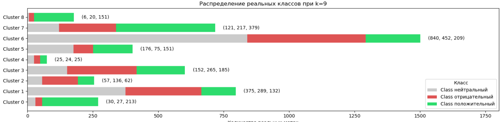
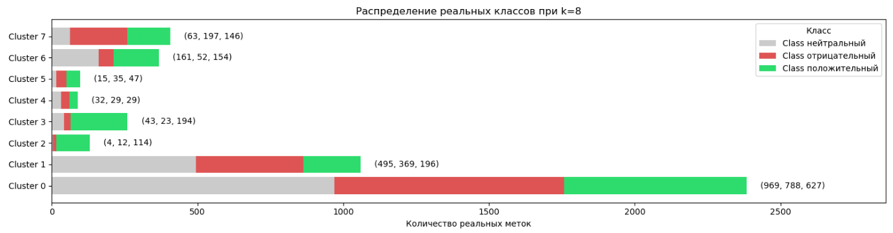
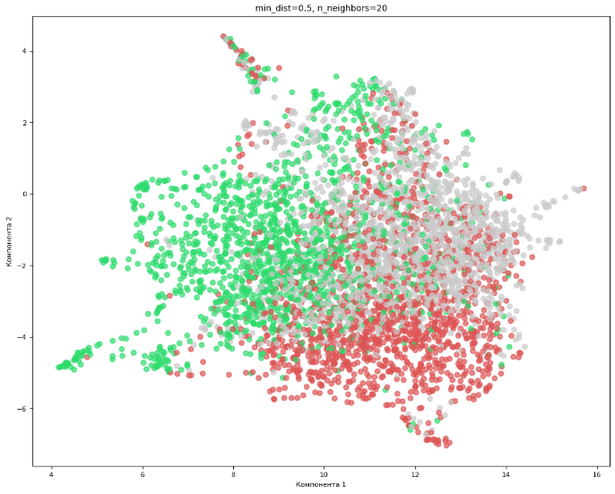
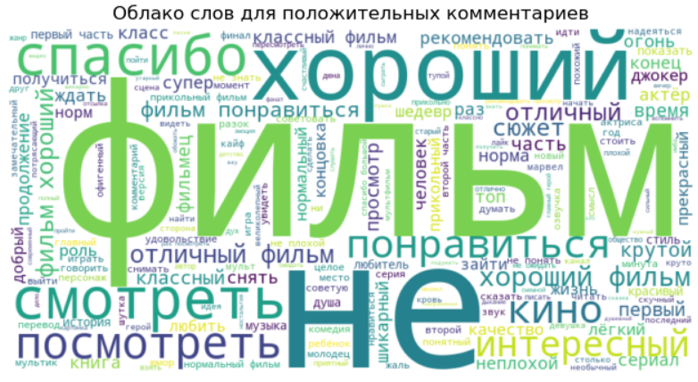
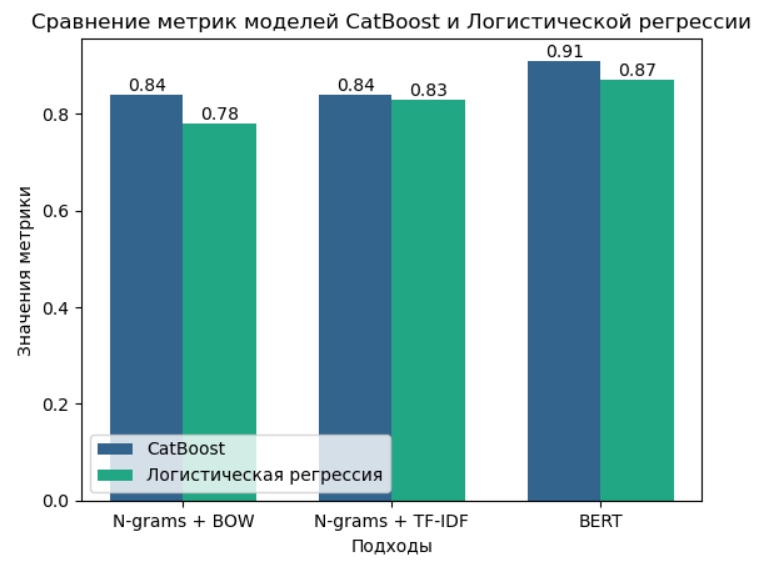
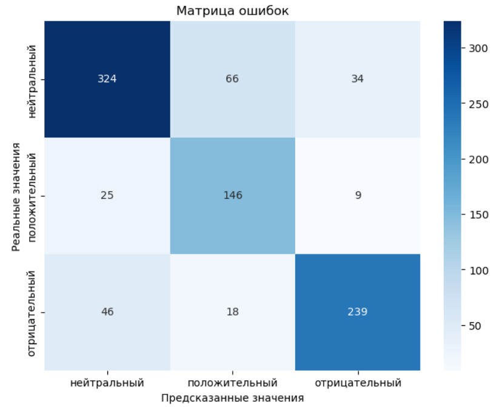

# Создание сервиса по оценке тональности комментариев RuTube

### Описание проекта
Проект посвящен созданию сервиса, который автоматически анализирует тональность комментариев под видео на RuTube. Основной целью является разработка платформы, где пользователь вводит ссылку на видео, а сервис возвращает сводную оценку тональности комментариев — будь то положительные, нейтральные или негативные реакции.📊  

В тетрадке `rutube_cluster.ipynb` можно увидеть процесс кластеризации комментариев.  
В тетрадке `rutube_comments.ipynb` находится небольшой EDA и обучение моделей.  

### Природа данных
Для реализации сервиса в проекте были вручную собраны данные — комментарии с RuTube — с помощью собственного парсера, код которого можно найти в соседней тетрадке. Этот парсинг обеспечил гибкость в сборе данных и позволил адаптировать их для дальнейшей обработки и обучения модели.📚💻

Далее данные были размечены вручную. С правилами разметки также можно ознакомиться в данном репозитории.📝

### Кому это может быть полезно:
* **Создателям контента**: RuTube-блогеры и создатели видео часто сталкиваются с большим количеством комментариев, которые трудно проанализировать вручную. Сервис поможет выявить преобладающее мнение аудитории и лучше понять реакцию на контент. Оценка тональности позволяет авторам оперативно адаптировать свой стиль, выбирать более популярные темы или корректировать подход к зрителям.🎬👥

* **Маркетологам и брендам**: Многие компании используют RuTube для продвижения товаров и услуг, выкладывая рекламные ролики или сотрудничая с популярными блогерами. Сервис тонального анализа комментариев помогает маркетологам оценить восприятие рекламных кампаний и реакцию целевой аудитории. Это особенно важно для улучшения коммуникационной стратегии и поддержания положительного имиджа бренда. 📈💡

* **Аналитикам и исследователям**: Исследователи могут использовать сервис для проведения качественного анализа отзывов на видеоконтент, будь то социальные или коммерческие исследования. Анализ тональности также полезен в изучении массовых тенденций и настроений, например, в изучении общественного мнения о социально-значимых темах.🔍🧠

* **Пользователям и зрителям**: В будущем сервис может быть полезен обычным зрителям, которые хотят узнать тональность обсуждений по определенной теме или автору, прежде чем вовлекаться в комментарии или делиться видео. 👀💬

### Основные этапы проекта:  
#### Парсинг данных  
Были получены комментарии под фильмами 2023-2024 года. Далее все комментарии были размечены вручную. Всего получилось около 4800 комментариев.

#### Кластерный анализ
Выполнен кластерный анализ, который помог оценить, насколько оценки тональности вообще прогнозируемы.
Путем кластерного анализа расмотрено распределение реальных меток в кластерах, изучены главные темы в кластерах, построена UMAP-карта, на которой отчетливо видно, что метки тональности хорошо различаются. 
  
Распределение меток в кластерах K-Means (количество кластеров подобрано с помощью метода локтя):  

Кластеры 0 и 8 неплохо показывают положительные комментарии. В 5-ом кластере больше говорят об благодарности и дают положительные оценки. В 6-ом кластере говорят о "первой части" и дают хорошие оценки - там больше всего нейтральных комментариев. 0 кластер - положительные комментарии, а 2 кластер - крайне негативные. Какие-то темы выделить не удалось. Это говорит о том, что некая тематика у кластеров есть, хоть и небольшая.  

Распределение меток в кластерах агломеративной кластеризации (количество кластеров подобрано с помощью метода силуэта):

Есть кластеры, в которых почти нет нейтральных комментариев, также есть кластеры с подавляющим большинством положительных. Изучим кластеры при 8 кластерах. Cамые популярные слова и биграммы в кластерах 3, 6, 2 носят положительную тональность (благодарности и хвалебные высказвания). В кластерах 1 и 4 нет явной тематики и больше похоже на спам. Остальные кластеры носят нейтральный и негативный характер. Это говорит о том, что в принципе, тональность моделируема.

Вот такой результат показала UMAP-карта:  

Именно UMAP карта дала четкое представление, что кластеры хорошо различаются между собой. Видно, что положительные комментарии расположились слева, нейтральные справа, а отрицательные - внизу.

#### Моделирование  
Выполнен небольшой EDA, построены облака слов для каждого типа тональности. Для положительного класса выглядит так:

Далее происходило обучение моделей. На этом этапе были задействованы такие техники как мешок слов, TF-IDF и BERT. Почему всё-таки решил использовать непопулярные подходы по типу мешков слов и TF_IDF подробно описал в тетрадке. Из моделей были использованы логистиечкая регрессия (ну а вдруг) и CatBoostClassifier. В качестве метрики выбрана ROC-AUC (хочется отличать каждый класс хорошо по отдельности). Гиперпарметры были подобраны с помощью Optuna. Ниже результаты моделирования:

Вот так ошибается модель:

